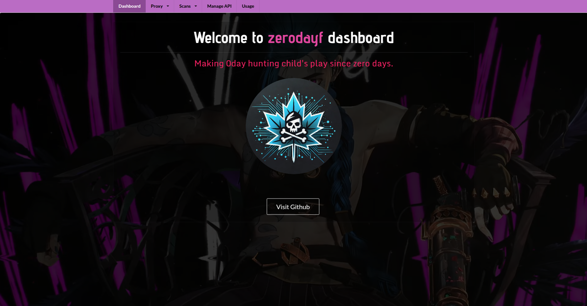

[]()
[]()
[]()
[]()

> <span style="color:red">**The repository is currently under maintenance, please come back later.**</span>

# 🌟 Introduction
> Zerodayf (zeroday factory) is an advanced code analysis platform that leverages artificial intelligence to identify vulnerabilities within source code. 

The system differentiates itself by offering a flexible approach to code analysis, enabling security professionals and developers to utilize their preferred AI models for comprehensive code evaluation beyond traditional vulnerability detection.

Zerodayf was created by a vulnerability researcher to make the process of 0day hunting easier in open-source web apps. Now, developers and hackers can outsource the entire process of code analysis to AI.

_**Pelase note Zerodayf is still in beta testing mode.**_


## Core Workflow
1. **Setup & Integration**: Configure Zerodayf’s proxy to intercept web traffic.
2. **Code Access**: Grant read-level access to the source code repository.
3. **Route Navigation**: Browse through endpoints like `/admin/dashboard`, `/posts/delete/1`, or `/login?redirect=/dashboard` to generate traffic.
4. **Code Mapping**: Zerodayf links accessed routes to backend components, including server-side code and template files.
5. **API Analysis**: Detects and maps client-side API calls (e.g., `fetch('/api/user')`, `Ajax.post('/api/delete-post')`) to backend handlers.
6. **AI Vulnerability scan**: Sends mapped code to an AI model for security analysis.


## 💡 Tutorial
Please watch the following demo to understand usage:


## ✨ Features
1. Raw proxy logging & beautified logging
2. Capturing start and end line ranges for mapped code
3. Viewing code and highlighting affected code
4. Ability to create multiple custom scan templates
5. Ability to add multiple APIs 
6. Ability to analyse a select number of code files of your choice
7. Ability to view running, completed & failed scans 
8. All scans are saved in the database so you can retain past progress
9. Map Ajax/Fetch API calls in templates to backend API code 

## 🛠️ Installation with Docker
Deploying Zerodayf via Docker container represents the most efficient implementation method, offering significant advantages over local installation.

To create a container, execute the following command in the Zerodayf root directory:
```bash
sudo docker-compose up --build -d
```

If you want to see the web app's logs, start without `-d` argument.

If you want to make changes and have them reflected, remove & start the container again:
```bash
sudo docker-compose down
sudo docker volume rm zerodayf_postgres_data
sudo docker-compose up --build -d
```


Upon successful execution, Zerodayf will be accessible at `127.0.0.1:1337`. 

Zerodayf uses MITMProxy for intercepting traffic so you must install and configure MITMproxy for your machine. Once you start the proxy, you can use the installation [steps on this page](https://mitm.it/) to setup MITMproxy. This page won't be accessible unless you activate proxy. 

The Docker container configuration implements the following specifications through the `Dockerfile`:
- Python 3.12.3 installation
- Installation of essential dependencies (pandoc, texlive-full, postgresql, etc.)
- Implementation of a database readiness verification script
- Port 1337 exposure for web application access

### Dockerfile Configuration
The docker-compose.yaml configuration file requires careful consideration due to its security implications:
- The `network_mode: "host"` setting grants the Docker container full access to your host network
- Volume configurations enable Docker to access host system files, with read-only (ro) access to the `/home` directory, where projects are expected to reside
- While database credentials can be modified, maintaining default values is recommended unless specifically required

This Docker-based deployment method provides the most streamlined approach to implementing Zerodayf.

## 📚 Documentation
1. [Introduction](./app/docs/1_intro.md)
2. [Getting started](./app/docs/2_getting_started.md)
3. [Database config](./app/docs/3_database_config.md)
4. [Frameworks](./app/docs/4_frameworks.md)
5. [Feedback](./app/docs/5_feedback.md)
6. [Contribute](./app/docs/6_contribute.md)
7. [Terms of Service](./app/docs/7_terms_of_service.md)
8. [Security](./app/docs/8_security.md)
9. [Thanks](./app/docs/9_thanks.md)

## 🛡️ Security
To report security vulnerabilities within Zerodayf, please read [SECURITY.md](./app/docs/8_security.md).


# 🤝 Acknowledgments
I extend my sincere gratitude to the HackSmarter community for their invaluable support and guidance throughout my cybersecurity journey. HackSmarter's collaborative spirit and expertise have been instrumental in shaping this project. Join the community on [Discord](https://discord.gg/HYAFwSSu7f).

I would also like to express my appreciation to the development teams behind ChatGPT-o1, DeepSeek R1, and Claude Sonnet 3.5. Their groundbreaking work in artificial intelligence has enabled individual developers like myself to create sophisticated tools like Zerodayf. Their commitment to advancing AI technology has made it possible to build innovative solutions that contribute to the cybersecurity community.

This project demonstrates how individual developers can leverage cutting-edge AI technology to create meaningful tools for the security and development community.

