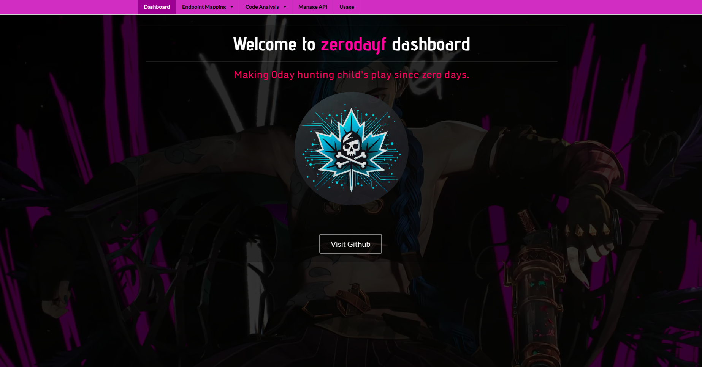

# 🌟 Introduction
> Zerodayf (Zeroday Factory) is an advanced code analysis platform that leverages artificial intelligence & Semgrep-OSS to identify vulnerabilities within source web apps written with any major backend framework such as Flask, Laravel, Rails, ASP.NET Core and others. 

The system differentiates itself by offering a flexible approach to code analysis, enabling security professionals and developers to utilize their preferred AI models for comprehensive code evaluation beyond traditional vulnerability detection.

Zerodayf was created by a [vulnerability researcher](https://hkohi.ca/whoami) to make the process of 0day hunting easier in open-source web apps. Now, developers and hackers can outsource the entire process of code analysis to AI.

_**Pelase note Zerodayf is still in beta testing mode.**_

## 10 Easy steps to get started 
1. Get a JSON mapping string from the app's debugger, see [Getting Started](./app/docs/3_getting_started.md)
2. Open `/code-map` in zerodayf and add new data (fill the form)
3. Go to `/manage-api` and set API key and model for an LLM model of your choice
4. Go to `/endpoint-mapping`, select the code mapping you created from the dropdown & load it
5. Go to `/analysis-templates` & load default semgrep & AI templates or create custom ones
6. Go to `/endpoint-mapping` & view an endpoint you want to test; select one or more files associated with the endpoint
7. Select either a `semgrep` or AI template; or select them both; set a scan name 
8. Click "Perform Analysis"
9. Check `/code-analysis` to see if analysis was completed 
10. View analysis report; download repprt as PDF, HTML, Markdown 

## 💡 Tutorial
Tutorial coming soon.

## ✨ Features
1. Perform analysis on any type of framework 
2. Map endpoints (e.g. `/login`) to backend code
3. Map API calls inside templates & .js files imported by the template to backend endpoints & code 
4. Works with any widely used templates such as .jsx, .html, .ts and others
5. Save endpoint mappings to a database table to keep track of them 
6. Load any endpoint mapping for vulnerability analysis
7. Perform AI, Semgrep analysis individually or combined
8. View code file, start & end line ranges will be highlighted to show relevant code for clarity
9. Create as many analysis templates as you want to look for different types of vulnerabilities or design flaws 
10. View analysis reports, download reports as PDF, HTML & Markdown for different applications 

## 📚 Documentation
1. [Introduction](./app/docs/1_intro.md)
2. [Installation](./app/docs/2_installation.md)
3. [Getting started](./app/docs/3_getting_started.md)
4. [Database config](./app/docs/4_database_config.md)
5. [Frameworks](./app/docs/5_frameworks.md)
6. [Contribute](./app/docs/6_contribute.md)
7. [Terms of Service](./app/docs/7_terms_of_service.md)

## 🛡️ Security
To report security vulnerabilities within Zerodayf, please read [SECURITY.md](./SECURITY.md).

